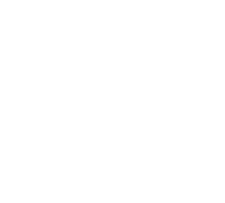

<table>
  <tr>
    <td>
      

        
      

    </td>
    <td>
      

        
      

    </td>
  </tr>
</table>

<!--

<h3 align="center">Hello, I'm Shane 👋</h3>

  

- 🔭 Toying with [seedling](https://github.com/shanedrabing/seedling), [pyrat](https://github.com/shanedrabing/pyrat), and [taxopedia](https://github.com/shanedrabing/taxopedia).

- 🌱 Just graduated Johns Hopkins, AAP with an MS in Bioinformatics!

- 👯 Mentoring the R language track at [exercism](https://exercism.org/profiles/shanedrabing)

- 💬 Ask me about tutoring on [Wyzant](https://www.wyzant.com/match/tutor/88172405)

- 📝 My (work-in-progress) website can be found [here](https://shanedrabing.github.io/)

- 🤔 Looking for connections to computational biology researchers

-->
